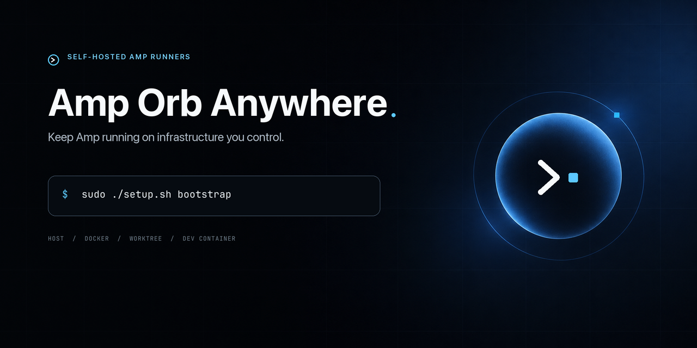

# Amp Orb Anywhere

<p align="center">
  
</p>

[](https://github.com/yannelli/amp-orb-anywhere/releases/latest)
[](https://github.com/yannelli/amp-orb-anywhere/actions/workflows/ci.yml)
[](https://github.com/yannelli/amp-orb-anywhere/commits/master)
[](https://github.com/yannelli/amp-orb-anywhere/stargazers)

- [Introduction](#introduction)
- [Requirements](#requirements)
- [Install](#install)
  - [Quick start](#quick-start)
  - [Cloud-init](#cloud-init)
  - [What bootstrap installs](#what-bootstrap-installs)
- [Create workspaces](#create-workspaces)
  - [Use the TUI](#use-the-tui)
  - [Provision a fleet](#provision-a-fleet)
  - [Script provisioning](#script-provisioning)
  - [Choose an Amp runtime](#choose-an-amp-runtime)
- [Authenticate](#authenticate)
  - [Amp and Git hosts](#amp-and-git-hosts)
  - [Codex and Claude Code](#codex-and-claude-code)
  - [Use API keys](#use-api-keys)
- [Connect remotely](#connect-remotely)
  - [Provider-native remote control](#provider-native-remote-control)
  - [Browser desktop](#browser-desktop)
- [Operate workspaces](#operate-workspaces)
  - [Common commands](#common-commands)
  - [Crash recovery and watchdogs](#crash-recovery-and-watchdogs)
  - [Persistent data](#persistent-data)
- [Keep everything updated](#keep-everything-updated)
  - [Automatic updates](#automatic-updates)
  - [Run an update now](#run-an-update-now)
  - [Pause automatic updates](#pause-automatic-updates)
  - [Update from a fork](#update-from-a-fork)
  - [Inspect update failures](#inspect-update-failures)
- [Feature compatibility](#feature-compatibility)
- [Security model](#security-model)
- [Networking and SSH](#networking-and-ssh)
- [Lightsail sizing](#lightsail-sizing)
- [Releases and SemVer](#releases-and-semver)
- [Validation](#validation)
- [References](#references)

## Introduction

Amp Orb Anywhere keeps coding-agent workspaces online on an Ubuntu host you control. It manages:

| Agent | Relationship to Amp | Supported runtime | Remote access |
| --- | --- | --- | --- |
| Amp | Registered self-hosted runner | Host, Docker, Git worktree, or Dev Container | Amp web, desktop, mobile, and CLI clients |
| OpenAI Codex | Independent, non-Amp-managed workspace | Docker | SSH/TUI, browser desktop, and experimental native Remote Control |
| Anthropic Claude Code | Independent, non-Amp-managed workspace | Docker | SSH/TUI, browser desktop, and supported headless Remote Control |

Each workspace has its own repository, systemd service, and optional browser desktop. Docker and Dev Container workspaces use named persistent homes; host and worktree Amp runners share the administrator account's home and credentials. The TUI can discover repositories, create several workspaces per repository, and manage the resulting fleet.

> [!IMPORTANT]
> A self-hosted Amp runner is not an Amp-managed orb. Managed orbs include fresh per-thread VMs, pause and resume, OIDC, project secrets, portals, apps, webhooks, multiplayer, and `amp sync`. This project provides local counterparts where practical, including systemd supervision and a secured browser desktop, but it cannot reproduce Amp's managed control plane. Run `sudo amp-runner-setup capabilities` for the current boundary.

The implementation and this guide were checked on 2026-08-02 against the current Amp manual, OpenAI Codex CLI documentation, OpenAI's secure Codex Dev Container profile, Anthropic's Claude Code setup guide, and Anthropic's Remote Control guide.

## Requirements

- A fresh Ubuntu 24.04 host. AWS Lightsail is the primary target.
- Root access through `sudo`.
- Outbound HTTPS, DNS, and WebSocket access to the agent providers, Git hosts, and package registries you use.
- A non-root administrator account for host-mode Amp runners. Lightsail uses `ubuntu`; set `AMP_RUNNER_ADMIN_USER` to override it.
- Enough disk and memory for the selected workloads. Start at 4 GB RAM for one light runner or 8 GB when using browsers and Docker builds.

Agent runners open outbound connections. They do not require an inbound application port.

## Install

### Quick start

Clone the repository onto the host and run bootstrap:

```bash
git clone https://github.com/yannelli/amp-orb-anywhere.git
cd amp-orb-anywhere
chmod +x setup.sh scripts/*.sh tests/test.sh
sudo ./setup.sh bootstrap
```

Bootstrap is idempotent. It installs the host toolchain, builds the generic agent image, installs `amp-runner-setup` under `/usr/local/sbin`, and enables automatic updates from the latest GitHub release.

Open the TUI and create a workspace:

```bash
sudo amp-runner-setup
```

After the wizard prints the workspace ID, open a Codex or Claude Code TUI over SSH:

```bash
sudo amp-runner-setup connect WORKSPACE_ID
```

For Amp, target the live runner ID from an Amp web, desktop, mobile, or CLI client. The manager's `connect` command applies only to Docker-backed Codex and Claude Code workspaces.

Optional bootstrap flags:

```bash
sudo ./setup.sh bootstrap [--harden-ssh] [--tailscale] [--non-interactive]
```

Runtime defaults can be overridden during bootstrap and image builds:

| Variable | Default | Purpose |
| --- | --- | --- |
| `NODE_MAJOR` | `24` | Node.js major from NodeSource |
| `GO_VERSION` | `latest` | Go release, resolved at install time |
| `RUST_TOOLCHAIN` | `stable` | Rust toolchain channel |

### Cloud-init

[`cloud-init.yaml`](cloud-init.yaml) bootstraps a fresh instance without embedding credentials. Before using it as Lightsail launch data, set the repository URL, branch, and administrator account. The default repository is this project.

Cloud-init runs the noninteractive host bootstrap. Complete account login over SSH afterward:

```bash
sudo amp-runner-setup
sudo ./setup.sh bootstrap --tailscale  # cloud-init does not install Tailscale
```

The first bootstrap usually takes 10 to 25 minutes because it installs native toolchains and builds the agent image. Watch it with:

```bash
cloud-init status --wait
sudo journalctl -u cloud-final.service
sudo tail -n 200 /var/log/cloud-init-output.log
```

Do not put Amp, GitHub, OpenAI, Anthropic, or Tailscale credentials in cloud-init user data. Instance metadata and logs can retain that data. Sign in interactively, or transfer a short-lived token file and delete the source after provisioning.

### What bootstrap installs

- Docker Engine, BuildKit, Buildx, and Compose from Docker's signed apt repository.
- Git, Git LFS, GitHub CLI, compilers, CMake, Ninja, and common native libraries.
- Node.js 24 LTS, current Go stable, Rust stable, Python 3.12, and OpenJDK 21.
- `agent-browser`, Chrome for Testing on amd64, Xvfb, ffmpeg, and ImageMagick.
- `gum`, `jq`, `ripgrep`, `fzf`, `shellcheck`, tmux, database clients, and diagnostics.
- Unattended security updates, fail2ban, and Docker log rotation.

The larger Webtop image is built when the first browser desktop is enabled.

## Create workspaces

### Use the TUI

Run the dashboard at any time:

```bash
sudo amp-runner-setup
```

The TUI uses searchable `gum` menus, with numbered shell menus as a fallback. It groups work by task instead of exposing systemd and Docker details. From the dashboard you can:

- add one workspace or provision a fleet;
- choose Amp, Codex, or Claude Code;
- search repositories and choose any subset;
- set the number of workspaces for each repository;
- choose authentication, runtime, remote-control, desktop, and Docker-access settings;
- start, stop, restart, connect to, authenticate, update, and remove workspaces;
- rotate API keys and browser-desktop passwords;
- inspect status, logs, update state, diagnostics, and feature compatibility.

Use `sudo amp-runner-setup add` to open the single-workspace wizard directly.

### Provision a fleet

The fleet wizard discovers repositories, allows multi-select, then asks for a workspace count for each selected repository:

```bash
sudo amp-runner-setup provision
```

Amp repository discovery uses `amp projects list`. Codex and Claude Code use the authenticated host `gh` account and include repositories where that identity is an owner, collaborator, or organization member. The wizard also provides an **all repositories** choice and previews the complete plan before creating anything.

Every generated workspace has a stable ID. Docker workspaces have separate agent and GitHub authentication state. Create missing Amp projects first with `amp projects create REPOSITORY`. Codex and Claude Code do not require an Amp project.

### Script provisioning

Provision one workspace noninteractively:

```bash
sudo amp-runner-setup add \
  --agent codex \
  --mode docker \
  --id codex-build-1 \
  --auth interactive \
  --repository owner/project \
  --clone \
  --no-remote-terminal \
  --native-remote \
  --desktop \
  --desktop-access ssh \
  --docker-access none
```

Provision several repositories by repeating `--repository`. Append `=COUNT` to request more than one workspace:

```bash
sudo amp-runner-setup provision \
  --agent amp \
  --mode docker \
  --auth token \
  --token-file /root/amp-token \
  --repository owner/api=2 \
  --repository owner/web=3 \
  --clone \
  --remote-terminal \
  --desktop \
  --desktop-access tailscale \
  --docker-access none
```

Common options:

| Option | Values | Behavior |
| --- | --- | --- |
| `--agent` | `amp`, `codex`, `claude` | Opens the agent picker when omitted |
| `--mode` | `host`, `docker`, `worktree`, `devcontainer` | Codex and Claude Code require `docker` |
| `--id` | DNS label | Stable lowercase ID used by units, containers, and volumes |
| `--auth` | `interactive`, `token` | Token mode requires `--token-file` |
| `--repository` | `owner/name` | Selects the checkout; repeat for fleet provisioning |
| `--workspace` | absolute path | Defaults below `/srv/amp-runners/workspaces` |
| `--clone` / `--no-clone` | flag | Controls whether setup clones the repository |
| `--remote-terminal` / `--no-remote-terminal` | flag | Amp only; permits a terminal in remotely controlled threads |
| `--native-remote` / `--no-native-remote` | flag | Codex and Claude Code only; requires account login |
| `--desktop` / `--no-desktop` | flag | Enables the per-workspace browser desktop |
| `--desktop-access` | `tailscale`, `ssh` | Chooses tailnet HTTPS or a loopback service reached through SSH |
| `--docker-access` | `none`, `socket` | Amp Docker mode only; defaults to no host Docker socket |

### Choose an Amp runtime

Codex and Claude Code run in Docker. Amp supports four runtime modes:

| Runtime | Use it for | Isolation | Main risk |
| --- | --- | --- | --- |
| `host` | One trusted runner on a dedicated VM | None | Amp and repository code have the VM user's access. Docker-group membership is equivalent to host root. |
| `docker` | Independent runners on one VM | Separate process, filesystem, network, home volume, and workspace | Containers share the host kernel. Mounting the Docker socket removes the useful host boundary. |
| `worktree` | Trusted concurrent work on one repository | Separate Git worktree | Workspaces share one Unix identity and Git object database. This is not a security boundary. |
| `devcontainer` | A repository with an existing `devcontainer.json` | Defined by the project | Lifecycle commands, host mounts, `privileged`, and Docker socket settings are trusted project code. |

The generic image contains a broad development toolchain. Containers drop Linux capabilities and set `no-new-privileges`; the `amp` user cannot use `sudo` at runtime. Add operating-system packages by rebuilding the image. Docker builds inside a workspace require `--docker-access socket` or a separate remote builder.

Dev Container mode uses `.devcontainer/devcontainer.json` or `.devcontainer.json` without rewriting it. Amp is installed in a named volume mounted at `/amp-runner-home`, so its login and state survive rebuilds.

## Authenticate

### Amp and Git hosts

Interactive Amp authentication runs `amp login` and prints a sign-in URL when used over SSH. Token authentication uses Amp's documented `AMP_API_KEY`. Create a token in [Amp security settings](https://ampcode.com/settings/security#access-token).

Amp workspaces are matched to projects by repository remote. The wizard reads `amp projects list --json`, clones the selected `repositoryURL`, then uses `amp projects status --json` to match that checkout. The persistent runner itself is started as:

```text
amp --no-tui --runner-id ID
```

Amp and Git-host authentication are separate. The wizard can run `gh auth login` for GitHub. `amp clone namespace/name` covers Amp-hosted repositories. Other private Git hosts need SSH keys, a credential helper, or another Git authentication mechanism for the runner identity.

For GitHub-backed Docker workspaces, setup transfers the authenticated host `gh` credential over stdin and configures Git's `gh` credential helper inside that workspace. It does not put the credential in the state file, Docker environment literals, process arguments, or a clone URL. Use a dedicated least-privilege GitHub identity if workspaces should not inherit your full account access.

### Codex and Claude Code

Authenticate a workspace with its provider account:

```bash
# Codex runs: codex login --device-auth
# Claude Code runs: claude auth login
sudo amp-runner-setup authenticate WORKSPACE_ID
```

Codex uses `CODEX_HOME=/agent-home/.codex`. Claude Code uses `CLAUDE_CONFIG_DIR=/agent-home/.claude`. Settings, OAuth state, and session history survive image and container replacement.

### One login for a fleet

Account-authenticated Codex and Claude Code workspaces share one login per provider by default. The credentials live in a root-only directory under `/etc/amp-runner/shared/PROVIDER` that is mounted into each workspace at the provider's own configuration path. Authenticate once and every current and future workspace for that provider is signed in:

```bash
sudo amp-runner-setup provision --agent claude --repository acme/api=5
# one claude auth login, five workspaces
```

Because the mount is the provider's live configuration directory rather than a copy, a token refreshed in one workspace stays valid in all of them. Codex keeps its Remote Control daemon PID file on a per-container `tmpfs`, so co-tenant workspaces cannot read each other's runtime state.

Give a workspace its own credentials with `--isolated-auth`:

```bash
sudo amp-runner-setup add --agent codex --isolated-auth
```

Shared credentials are a deliberate trade. Any workspace that can reach them can act as that provider account, so one compromised repository reaches every other workspace's account access. Use `--isolated-auth` for an untrusted repository, and a separate VM when workspaces must be mutually unreachable. Workspaces created before this release keep their existing isolated credentials until they are recreated.

### Use API keys

Token-authenticated workspaces read their API key from a root-owned file under `/etc/amp-runner/secrets`. The key is mounted read-only when the agent starts. It is not written into an image layer, instance state, a Docker environment literal, or process arguments.

Create or rotate a Codex or Claude Code key without putting it in shell history:

```bash
sudo amp-runner-setup credentials set WORKSPACE_ID --token-file /secure/key
sudo amp-runner-setup credentials clear WORKSPACE_ID
```

These credential commands reject Amp workspaces. Supply an Amp token with `--auth token --token-file PATH` when provisioning that runner. Delete the source token file after setup. Clearing a Codex or Claude Code key leaves any interactive login in the persistent home volume unchanged.

Provider-native Remote Control requires account login. API-key-only workspaces cannot use it.

## Connect remotely

### Provider-native remote control

| Workspace | Remote workflow | Status |
| --- | --- | --- |
| Amp | Target the live runner ID from Amp web, desktop, mobile, or another Amp client | Supported |
| Claude Code | `claude remote-control --name WORKSPACE_ID --spawn same-dir`, then use [claude.ai/code](https://claude.ai/code) or the Claude mobile app | Supported headless research preview |
| Codex | `codex remote-control start`, `stop`, and `pair` inside the workspace container | Experimental |

Manage native provider control with:

```bash
sudo amp-runner-setup remote enable WORKSPACE_ID
sudo amp-runner-setup remote status WORKSPACE_ID
sudo amp-runner-setup remote pair CODEX_WORKSPACE_ID
sudo amp-runner-setup remote disable WORKSPACE_ID
```

Claude Remote Control is enabled by default for interactive Claude workspaces. The authentication flow opens Claude once to satisfy the workspace-trust prompt. Remote Control requires a Pro, Max, Team, or Enterprise subscription. Team and Enterprise owners must allow it in Claude Code administration settings.

The server runs in the upstream default `same-dir` spawn mode, so several devices can hold sessions against the workspace at once. `--spawn session` serves exactly one session and rejects further connections, which is why it is not used here.

Remote Control needs a claude.ai account token. It refuses to start when `ANTHROPIC_API_KEY` is set, so the launcher keeps API keys away from `claude remote-control` and `claude auth`. An API-key-only workspace cannot use Remote Control at all.

A workspace provisioned without a terminal has no login yet. Rather than idling, the container polls every 30 seconds and starts Remote Control as soon as `authenticate` succeeds, with no restart needed. `remote status` reports `awaiting login` until then.

Codex Remote Control is opt-in. This project supervises the `remote-control` commands currently shipped by Codex, but OpenAI's public remote documentation describes mobile control through the Codex desktop app on macOS or Windows, including projects reached from that app over SSH. OpenAI does not guarantee direct headless Linux or container pairing as an end-user workflow. Expect the experimental command and pairing behavior to change.

Starting `codex remote-control start` is not the same as being visible in the Codex app. Pairing is a separate step and nothing runs it for you:

```bash
sudo amp-runner-setup remote pair CODEX_WORKSPACE_ID
```

If pairing a headless container does not surface the workspace, use the route OpenAI documents instead: reach this host over Tailscale SSH and add it in the Codex app under Settings, Connections, Add SSH Host, then select the workspace directory. The app starts its own `codex app-server` over that SSH connection. Do not expose the app server on a public network; a tailnet is the recommended transport.

Both provider relays use outbound TLS and open no inbound container port. Synchronized sessions remain subject to the provider's data policy.

### Browser desktop

Every agent workspace can have a separate LinuxServer Webtop desktop with:

- XFCE Terminal;
- Chromium;
- Firefox ESR;
- Thunar file manager;
- read-write access to `/workspace`;
- persistent browser profiles and desktop settings;
- Codex or Claude Code plus its persistent `/agent-home`, when applicable.

Enable it during provisioning with `--desktop`, or later:

```bash
sudo amp-runner-setup desktop enable WORKSPACE_ID --access tailscale
sudo amp-runner-setup desktop credentials WORKSPACE_ID
```

The first enable builds an image that can exceed one gigabyte. Setup generates a 48-character password, stores both login fields as root-only files, and mounts them read-only into Webtop. Rotate the password with:

```bash
sudo amp-runner-setup desktop rotate-password WORKSPACE_ID
```

Access choices:

- `tailscale` publishes `https://HOSTNAME.ts.net/desktop/WORKSPACE_ID/` through Tailscale Serve. Tailscale terminates TLS and applies tailnet policy; Webtop still requires its generated username and password. Tailscale can print a one-time consent URL when HTTPS or Serve has not been enabled for the tailnet.

  Serve owns the `/desktop/WORKSPACE_ID` mount point and forwards the remainder of the path, so the container serves at its own root in both access modes. Configuring the container to expect the same prefix made it answer with its web server's default page instead of the desktop. After enabling tailnet access, `desktop enable` now fetches the real tailnet URL and reports that specific failure, because the loopback health check never traverses the proxy and passes either way.
- `ssh` binds Webtop to host loopback. `desktop credentials` prints the SSH forwarding command, local HTTPS address, and login. Webtop's self-signed certificate remains inside the encrypted SSH tunnel.

The installer never binds Webtop to `0.0.0.0` and does not use Tailscale Funnel. The desktop container receives no Docker socket and no privileged mode. It is also started with `DISABLE_SUDO=true`, but that variable is not part of the documented LinuxServer image contract and this project does not remove `sudo` from the image, so do not rely on it as a boundary. A signed-in user has a terminal, browser network access, repository write access, and the workspace's agent credentials. Treat browser-desktop access like shell access.

This desktop is provided by the project. It is not an Amp portal, does not attach to an orb thread, and does not inherit Amp-managed OIDC or secrets.

## Operate workspaces

### Common commands

| Task | Command |
| --- | --- |
| Open the dashboard | `sudo amp-runner-setup` |
| List all workspaces | `sudo amp-runner-setup list` |
| Inspect one workspace | `sudo amp-runner-setup status WORKSPACE_ID` |
| Follow logs | `sudo amp-runner-setup logs WORKSPACE_ID --follow` |
| Start, stop, or restart | `sudo amp-runner-setup start\|stop\|restart WORKSPACE_ID` |
| Open a Codex or Claude Code TUI | `sudo amp-runner-setup connect WORKSPACE_ID` |
| Open a Docker workspace shell | `sudo amp-runner-setup shell WORKSPACE_ID` |
| Run Codex noninteractively | `sudo amp-runner-setup connect CODEX_ID -- exec 'Review the changes'` |
| Run Claude Code noninteractively | `sudo amp-runner-setup connect CLAUDE_ID -- -p 'Review the changes'` |
| Change Amp remote-terminal access | `sudo amp-runner-setup configure AMP_ID --remote-terminal` |
| Run diagnostics | `sudo amp-runner-setup doctor` |
| Show feature boundaries | `sudo amp-runner-setup capabilities` |
| Remove configuration and retain data | `sudo amp-runner-setup remove WORKSPACE_ID` |
| Remove configuration and persistent volumes | `sudo amp-runner-setup remove WORKSPACE_ID --purge` |

An explicit `stop` remains stopped. Start or restart the workspace when it should return to service.

### Crash recovery and watchdogs

Each workspace receives an `amp-runner-WORKSPACE_ID.service` systemd unit with:

```text
Restart=always
RestartSec=5s
TimeoutStopSec=45s
StartLimitIntervalSec=0
```

There is no restart-attempt limit. A failed process or container is recreated after five seconds, including after repeated crashes and host reboots.

- Amp runs as the foreground service process, so an Amp CLI crash exits the unit and triggers restart.
- Claude Code Remote Control runs as the foreground container process, so its exit triggers restart.
- Codex Remote Control starts a background daemon. The supervisor waits up to 60 seconds for the daemon to write its PID file, then checks its daemon PID every 30 seconds; a missing daemon exits the container and triggers restart. Without that start window the first check could fire before the daemon had written the file and crash-loop the container.
- A provider that cannot start because nobody has signed in yet does not crash-loop. The container polls every 30 seconds and starts the remote server as soon as the login succeeds.
- Workspaces without a provider-native remote server intentionally keep an idle foreground container online until `connect`, `shell`, or the browser desktop starts a CLI.

This watchdog detects dead processes. Amp, Codex, and Claude Code do not expose a stable local health endpoint that proves provider connectivity or successful task processing. A process that remains alive while hung is not restarted. `doctor` verifies tools, memory, disk, and process state; it does not prove that an Amp runner is registered or that a provider can accept work.

Logs go to journald:

```bash
sudo journalctl -u amp-runner-WORKSPACE_ID.service -f
```

### Persistent data

| Path | Contents |
| --- | --- |
| `/opt/amp-runner` | Installed manager and image sources |
| `/etc/amp-runner/instances` | Non-secret workspace metadata |
| `/etc/amp-runner/secrets` | File-backed Amp, OpenAI, Anthropic, and Webtop credentials |
| `/etc/amp-runner/shared` | Shared per-provider account logins |
| `/srv/amp-runners/workspaces` | Default workspaces |
| `/srv/amp-runners/repositories` | Base repositories used by worktree mode |
| `amp-runner-WORKSPACE_ID-home` volume | Agent state, authentication, configuration, sessions, GitHub CLI, and shell state |
| `amp-runner-WORKSPACE_ID-desktop` volume | Desktop home, browser profiles, and XFCE settings |

Agent containers run with `HOME=/agent-home` so anything a shell or `docker exec` writes to the home directory lands in that volume. The container's own filesystem is discarded on every restart, so packages installed at runtime outside `/workspace` and `/agent-home` do not survive.

The agent CLIs are installed into the home volume rather than the image, which is why `update` reruns the vendor installers inside the volume. Deleting the volume removes the CLI installation and the login together.

`remove` retains workspaces and Docker home volumes, prints where they are, and refuses to reuse that workspace ID until they are reclaimed. `remove --purge` deletes them. Retained volumes can contain agent and Git-host credentials. `uninstall` removes services and the manager but leaves operating-system packages installed.

Override install paths with `AMP_RUNNER_INSTALL_DIR`, `AMP_RUNNER_CONFIG_DIR`, `AMP_RUNNER_DATA_DIR`, `AMP_RUNNER_IMAGE`, and `AMP_RUNNER_DESKTOP_IMAGE`.

## Keep everything updated

### Automatic updates

Bootstrap enables `amp-runner-update.timer` by default. Its exact systemd schedule is:

| Setting | Value |
| --- | --- |
| Earliest first run after boot | 10 minutes |
| Repeat interval | 6 hours |
| Randomized delay | Up to 20 minutes |

This is a monotonic timer (`OnBootSec` and `OnUnitActiveSec`), not a calendar timer. After a reboot it schedules a new run for 10 minutes later, plus the randomized delay; it does not immediately replay intervals missed while the host was off.

Check whether it is enabled and see the next run:

```bash
sudo amp-runner-setup auto-update status
sudo systemctl list-timers --all amp-runner-update.timer
```

One cycle updates four layers:

1. **Manager:** checks the latest GitHub release for `yannelli/amp-orb-anywhere`. A newer release archive replaces the installed manager only after its tag, declared `VERSION`, and Bash syntax pass validation.
2. **Agent image:** resolves current Amp, Codex, and Claude Code versions, rebuilds the generic image with the vendors' official native installers, and replaces affected containers.
3. **Amp runners:** runs `amp update` in every persistent Amp home and restarts each Amp service so the new CLI is active.
4. **Browser desktop:** rebuilds the Webtop image and restarts enabled desktops only when the resulting image changed.

A manager release forces agent and desktop refreshes because its image or service contract might have changed. On an ordinary cycle with no manager release, Codex and Claude Code containers restart only when the generic image ID changed; desktop services restart only when their image ID changed. Amp services restart after their explicit update check. An update can interrupt an active agent session or browser desktop.

Workspace directories and named home volumes are not removed during updates. The manager keeps a backup while activating a new release. Image and service updates use rollback paths when replacement fails.

There are also agent-native update layers:

- Amp's `amp.updates.mode` defaults to `auto`; `amp update` applies one immediately.
- Claude Code's native installation follows the `latest` channel by default, checks in the background, and supports `claude update`.
- Codex's official standalone installer is rerun by this manager when images are rebuilt. OpenAI currently documents rerunning the same installer as the update command.

The systemd timer keeps idle and headless workspaces current without depending on an interactive agent session.

> [!WARNING]
> The update service runs as root and treats GitHub releases from its configured repository as trusted code. Release archives are downloaded over TLS and validated for internal version consistency and Bash syntax; this project does not add an independent release-signing layer. Point forks only at a repository you control.

### Run an update now

Run the same complete cycle used by the timer:

```bash
sudo systemctl start amp-runner-update.service
```

Run one layer directly:

```bash
# Install the newest manager release. If it changes, refresh all agents and desktops.
sudo amp-runner-setup self-update

# Rebuild the generic image, update agent CLIs, and restart selected services.
sudo amp-runner-setup update --all
sudo amp-runner-setup update WORKSPACE_ID

# Rebuild the Webtop image and restart selected enabled desktops.
sudo amp-runner-setup desktop-update --all
sudo amp-runner-setup desktop-update WORKSPACE_ID
```

`self-update` exits without refreshing images when the installed manager is already current. Use the systemd service or the two explicit `update` commands when you want every layer checked now.

### Pause automatic updates

Disable or re-enable the project timer:

```bash
sudo amp-runner-setup auto-update disable
sudo amp-runner-setup auto-update enable
```

This controls the root systemd timer only. It does not change Amp's `amp.updates.mode` or Claude Code's native updater settings inside existing agent homes. Disable those separately if every update path must be pinned. Amp documents `amp.updates.mode="disabled"` and `AMP_SKIP_UPDATE_CHECK=1`; Claude Code documents `DISABLE_AUTOUPDATER=1` for background checks and `DISABLE_UPDATES=1` for all update paths.

### Update from a fork

Reinstall the timer with your fork as the release source:

```bash
sudo env AMP_RUNNER_UPDATE_REPOSITORY=owner/repository \
  amp-runner-setup auto-update enable
```

The generated systemd service stores that repository setting, so it survives reboots and does not depend on a shell profile. The fork must publish SemVer GitHub releases with the same archive layout and synchronized `VERSION` file.

### Inspect update failures

```bash
sudo systemctl status amp-runner-update.timer
sudo systemctl status amp-runner-update.service
sudo journalctl -u amp-runner-update.service -n 200
sudo journalctl -u amp-runner-update.service -f
```

The timer schedules work; the one-shot service performs it. A failed service remains visible in systemd and journald while the timer schedules the next attempt.

## Feature compatibility

| Capability | Self-hosted support | Notes |
| --- | --- | --- |
| Independent Codex and Claude Code workspaces | Yes | Persistent Docker home and repository, interactive login or API key |
| Claude Code Remote Control | Yes | Documented outbound-only headless relay with web and mobile sessions |
| Codex Remote Control | Experimental | Uses shipped CLI daemon and pairing commands; OpenAI does not guarantee direct headless-container parity with its desktop remote workflow |
| Amp remote thread creation | Yes | A client can target a live runner ID |
| Amp remote terminal | Yes | Opt in per runner with `--remote-terminal` |
| Browser desktop | Yes | Tailnet HTTPS or SSH tunnel, generated login, terminal, Chromium, Firefox, and Thunar |
| Amp modes, Fast, plugins, skills, MCP, and schedules | Yes | Selected per thread; the runner must stay online |
| Browser automation | Host and generic Docker modes | Includes `agent-browser`, headless Chrome, and Xvfb; project Dev Containers control their own tools |
| Fresh machine and clone per thread | No | A self-hosted runner reuses its checkout and machine |
| Pause and resume | No | systemd can stop a service, but there is no Amp-managed snapshot lifecycle |
| Orb portals, apps, and `.amp/services.yaml` supervision | No | The browser desktop is a project-provided Webtop, not an Amp portal |
| Orb OIDC, project secrets, and webhook wakeups | No | These require Amp's managed identity and event infrastructure |
| Multiplayer orb access and `amp sync` | No | These are managed-orb thread features |

`.agents/setup`, `.agents/resume`, and `.amp/services.yaml` are orb lifecycle inputs. A persistent runner can read repository guidance, plugins, and skills, but it does not automatically execute those orb setup contracts.

Amp does not currently document a CLI desktop experiment to enable here. This project does not write guessed experimental settings into Amp configuration. It uses documented Amp behavior and supplies its own browser desktop. Custom experimental agent modes can be registered through Amp plugins.

## Security model

Use `host` for one trusted repository on a dedicated VM. Use `docker` without the host Docker socket when co-located workspaces should not read each other's files. Put hostile repositories, separate organizations, or mutually unreachable credentials on separate VMs. Linux containers share the host kernel and are weaker isolation than VMs.

Codex requires an exception to the default container profile. Its current Linux sandbox uses setuid bubblewrap. The headless workspace adds only `SYS_ADMIN`, `SYS_CHROOT`, `SETUID`, `SETGID`, and `SYS_PTRACE`, and disables the outer Docker seccomp and AppArmor profiles. Webtop keeps Docker's default root-init capability set and adds the same sandbox capabilities. Codex applies its inner seccomp policy after bubblewrap creates its namespace. This is narrower than `--privileged` and excludes OpenAI's optional firewall-only `NET_ADMIN` and `NET_RAW`, but it weakens the outer container boundary. Claude Code needs none of these additions.

Amp executes tools without approval by default. Use an Amp policy plugin or permissions configuration where a repository needs command restrictions. Policy running under the same account cannot contain malicious code that already has host execution.

Interactive Amp credentials live in the runner's persistent home, currently under `~/.local/share/amp/secrets.json` on Linux. File-backed keys live under `/etc/amp-runner/secrets` with mode `0400`. Child commands launched by an agent can inherit its environment. Use dedicated, revocable, least-privilege credentials.

Codex and Claude Code account logins are shared across workspaces by default and live under `/etc/amp-runner/shared` with mode `0700`. That is one credential boundary for every workspace using the same provider, so it does not separate organizations or trust levels. Pass `--isolated-auth` to keep a workspace's credentials to itself, and put mutually untrusted repositories on separate VMs.

## Networking and SSH

Amp documents these required outbound domains: `ampcode.com`, `auth.ampcode.com`, `production.ampworkers.com`, and `static.ampcode.com`. Git hosts, package registries, model providers, MCP servers, and Tailscale need their own outbound access.

For a Lightsail firewall:

1. Remove the default public HTTP rule unless another service needs it.
2. Restrict TCP 22 to your current public IP or VPN CIDR. Lightsail has separate IPv4 and IPv6 firewalls.
3. Do not expose Docker port 2375, Webtop ports, databases, development servers, or browser-debugging ports. Use Tailscale Serve or the generated SSH tunnel.
4. After Tailscale SSH is working, remove public SSH from both Lightsail firewalls. Keep the Lightsail browser console as a recovery path.

Optional SSH hardening disables passwords, keyboard-interactive login, root login, and X11 forwarding. It refuses to continue until the administrator account has an `authorized_keys` file. Open a second key-authenticated session before enabling it. TCP forwarding remains enabled for development tunnels.

Tailscale is installed from its signed Ubuntu repository. Bootstrap detects an existing installation and skips both the package install and `tailscale up` when the node is already authenticated and online, so re-running bootstrap to repair a host does not rewrite the keyring or re-prompt for login. On a fresh host it runs `tailscale up --ssh`, which is what makes step 4 above and the Codex SSH-host route possible. Tailscale recommends disabling key expiry only for trusted servers, with prompt key revocation after loss or compromise.

## Lightsail sizing

Public IPv4 Linux bundle prices checked on 2026-08-01 from the [Lightsail pricing page](https://aws.amazon.com/lightsail/pricing/):

| Workload | Suggested minimum | General-purpose bundle |
| --- | --- | --- |
| One host runner, light Node or Python work | 2 vCPU, 4 GB RAM, 80 GB disk | $24/month |
| One runner with browsers, Java, or Docker builds | 2 vCPU, 8 GB RAM, 160 GB disk | $44/month |
| Two to four container workspaces | 4 vCPU, 16 GB RAM, 320 GB disk | $84/month |
| CPU-heavy builds | 4 vCPU, 8 GB RAM, 320 GB disk | $84/month compute optimized |

The 1 GB and 2 GB plans are too small for the installed images and ordinary agent workloads. Compiler, browser, and language-server processes can each consume several gigabytes. Watch memory, disk, Docker build cache, and inode usage. A 2 to 4 GB swap file can absorb short spikes; sustained swap pressure makes agents unresponsive.

Lightsail instances continue billing while stopped. Snapshots and attached disks are separate charges. A static IPv4 address is free while attached to a running instance. The agents do not require one because they dial out.

## Releases and SemVer

The project uses [Semantic Versioning](https://semver.org/) and Release Please. Three files stay synchronized in each release:

- `VERSION`;
- `.release-please-manifest.json`;
- the embedded manager version in `setup.sh`.

Conventional commits determine the next release:

| Commit | Release |
| --- | --- |
| `fix: ...` | Patch |
| `feat: ...` | Minor |
| `feat!: ...`, `fix!: ...`, or a `BREAKING CHANGE:` footer | Major |

CI runs the Bash test suite and ShellCheck on pushes and pull requests. After releasable commits reach `master`, Release Please updates a release PR with the version bump and `CHANGELOG.md`. Merging that PR creates `vX.Y.Z` and a GitHub release. `self-update` and the systemd timer consume that release.

The repository must grant GitHub Actions read/write access and allow Actions to create pull requests. The release workflow uses the repository `GITHUB_TOKEN`; this project stores no separate release token.

## Validation

Run the repository checks without modifying the host:

```bash
./tests/test.sh
shellcheck setup.sh scripts/*.sh tests/test.sh
bash -n setup.sh scripts/*.sh tests/test.sh
```

The suite checks Bash syntax, version consistency, workspace IDs, fleet parsing, provider dispatch, project selection, command help, secret handling, Codex sandbox arguments, security defaults, systemd supervision, and the automatic updater.

A full Docker build is separate because it downloads several gigabytes:

```bash
docker build --pull -t amp-runner:test .
docker run --rm amp-runner:test amp --version
docker run --rm amp-runner:test codex --version
docker run --rm amp-runner:test claude --version
```

## References

- [Amp Owner's Manual](https://ampcode.com/manual)
- [Amp Orbs manual](https://ampcode.com/manual/orbs)
- [Amp security reference](https://ampcode.com/security)
- [OpenAI Codex CLI](https://developers.openai.com/codex/cli)
- [OpenAI Codex authentication](https://developers.openai.com/codex/auth)
- [OpenAI Codex remote connections](https://developers.openai.com/codex/remote-connections)
- [OpenAI Codex secure Dev Container profile](https://github.com/openai/codex/blob/main/.devcontainer/devcontainer.secure.json)
- [Anthropic Claude Code setup](https://code.claude.com/docs/en/setup)
- [Anthropic Claude Code Remote Control](https://code.claude.com/docs/en/remote-control)
- [Anthropic Claude Code development containers](https://code.claude.com/docs/en/devcontainer)
- [Release Please](https://github.com/googleapis/release-please)
- [agent-browser](https://agent-browser.dev/installation)
- [LinuxServer Webtop](https://docs.linuxserver.io/images/docker-webtop/)
- [Tailscale Serve](https://tailscale.com/docs/features/tailscale-serve)
- [Docker Engine on Ubuntu](https://docs.docker.com/engine/install/ubuntu/)
- [Docker daemon security](https://docs.docker.com/engine/security/)
- [Dev Container CLI](https://github.com/devcontainers/cli)
- [GitHub CLI Linux installation](https://github.com/cli/cli/blob/trunk/docs/install_linux.md)
- [Tailscale Linux installation](https://tailscale.com/docs/install/linux)
- [Lightsail firewall rules](https://docs.aws.amazon.com/lightsail/latest/userguide/understanding-firewall-and-port-mappings-in-amazon-lightsail.html)
